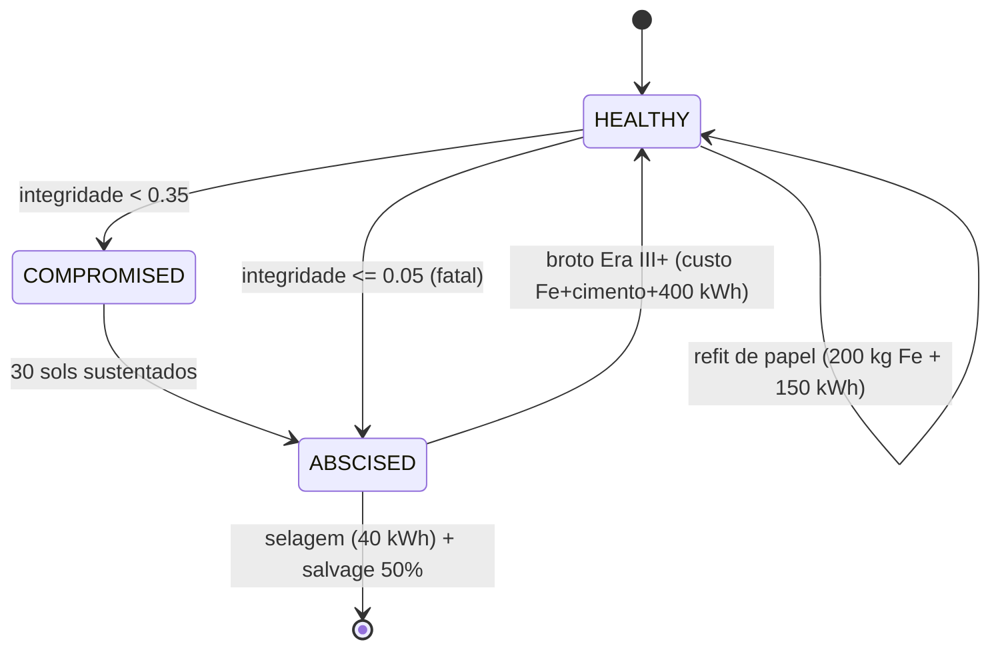

# ArmsMesh — Tecido de Braços Redundantes (v21 / PH-8)

`src/agriculture/mars_unified_simulator.py` — classe `ArmsMesh`

Árvores não consertam ramos mortos — elas **abscindem**. A malha de **12 braços radiais** trata cada braço como tecido sacrificável: perder um braço não mata o organismo — a malha realoca a função entre os sobreviventes.

## Doutrina de capacidade de absorção (v21)

Os braços não são homogêneos e não rodam em capacidade plena — a absorção é **projetada**, não improvisada:

- **Manifesto de papéis** — `4 estufa + 3 habitat + 3 conduíte + 2 lab`. O nominal de serviço é fixo no manifesto de projeto: o drift de papéis não move o denominador — a telemetria expõe o desvio em vez de escondê-lo
- **Headroom 70%** — os braços operam a 70% do nominal; `serviço = min(1, vivos/nominal/0,7)`. Perder ~30% dos braços de um papel não degrada a função — os 8 sobreviventes distribuem o trabalho dos 12
- **Conversão improvisada** — quando a perda excede o headroom, a malha já tem o mapa: um braço vivo é REFEITO no papel perdido, doado pela ordem de sacrifício `lab → conduíte → habitat → estufa` (pesquisa adia; comida é vital). Refit custa 200 kg Fe + 150 kWh — é operação, não decreto
- **Previsão de reabastecimento** — a taxa móvel de abscisão dos últimos 3 sínodos × lead time de 2 sínodos projeta os módulos-reserva da janela de arquitetura terrestre. Reabastecimento deixa de ser palpite e vira telemetria

## Ciclo de vida

## As leis

1. **Histerese** — dip de 1 sol não abscinde; 30 sols sustentados ou falha fatal sim
2. **Cicatriz precede broto** — nenhum braço renasce no sol em que foi selado
3. **Conservação na colheita** — `salvaged + lost = 40 t` por braço; a fração (50%) volta ao estoque como Fe + cimento
4. **Neutralidade de massa** — custo do broto = massa colhida (12 t Fe + 8 t cimento): o ciclo não lucra, o preço é energia + tempo
5. **Chão do tronco** — metade da estufa vive no tronco: `greenhouse_factor ∈ [0,5; 1,0]`, perder todos os braços não zera a cadeia alimentar
6. **Papel-alvo antes da malha** — o papel do broto é decidido ANTES de reabrir o socket (o braço recém-vivo não pode inflar o serviço do próprio papel e desviar a decisão)

## Bugs pegos no longrun

- **Exploit de auto-mineração** (v20 draft): salvage de 20 t ≫ custo do broto de 2,3 t → o ciclo abscisão→broto minerava a própria estação em +17,7 t/ciclo (235 ciclos). Corrigido casando custo do broto com a massa colhida
- **Broto sem papel** (v21 draft): o braço renascia contando-se como vivo antes da escolha do papel — `service()` inflava e todos os brotos nasciam no papel errado; a malha terminava com 0 braços de estufa com 12/12 vivos. Corrigido decidindo o papel-alvo antes de reabrir a malha

## Trajetória canônica v21

| Métrica | v21 |
|---|---:|
| Braços | 12 — manifesto 4 estufa / 3 habitat / 3 conduíte / 2 lab |
| Abscissões ↔ brotos | 24 ↔ 24 |
| Conversões improvisadas | 9 |
| Serviços no final | todos 1,0 (headroom + refit absorveram o inverno) |
| Salvaged / lost | 480 t / 480 t |
| Drift do manifesto | estufa 4→3 (serviço 1,0 via headroom), lab 2→3 |
| Forecast de reservas | pico de 2 módulos/sínodo durante a onda de senescência |

## Pendências (honestas)

- Mobilidade de braço (MobileNode — a metade "retorno" do par aberto) ainda não existe
- Habitat/conduíte/lab são papéis de serviço — efeitos downstream (moral da tripulação, throughput de conduíte) ainda não alimentam outras cadeias
- Braço compromised é binário — deveria degradar produção antes de morrer
