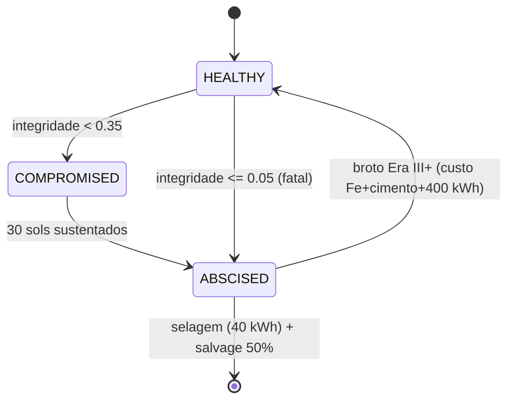

# ArmsMesh — Tecido de Braços Redundantes (v20 / PH-8)

`src/agriculture/mars_unified_simulator.py` — classe `ArmsMesh`

Árvores não consertam ramos mortos — elas **abscindem**. A malha de 8 braços radiais trata cada braço como tecido sacrificável: perder um braço não mata o organismo — a malha realoca a função entre os sobreviventes.

## Ciclo de vida

## As leis

1. **Histerese** — dip de 1 sol não abscinde; 30 sols sustentados ou falha fatal sim
2. **Cicatriz precede broto** — nenhum braço renasce no sol em que foi selado
3. **Conservação na colheita** — `salvaged + lost = 40 t` por braço; a fração (50%) volta ao estoque como Fe + cimento
4. **Neutralidade de massa** — custo do broto = massa colhida (12 t Fe + 8 t cimento): o ciclo não lucra, o preço é energia + tempo
5. **Chão do tronco** — metade da estufa vive no tronco: `greenhouse_factor ∈ [0,5; 1,0]`, perder todos os braços não zera a cadeia alimentar

## O exploit pego no longrun

Primeira versão: salvage de 20 t ≫ custo do broto de 2,3 t → o ciclo abscisão→broto **minerava a própria estação** em +17,7 t líquido por ciclo (235 ciclos no longrun). Corrigido casando o custo do broto com a massa colhida — teste `test_sprout_cycle_is_mass_neutral` trava a classe inteira dessa falha.

## Trajetória canônica v20

O inverno de braços da Era II: a primeira coorte senesceu quase em conjunto (8/8 → 1/8 entre sols ~4.700–7.000, Era II sem broto), a estação operou no piso do tronco, e a Era III re-brotou a malha — **46 abscisões ↔ 46 brotos** em equilíbrio na copa.

| Métrica | v20 |
|---|---:|
| Massa útil | 8.131,4 t |
| Braços (final) | 8/8 — integridade 0,37–0,99 |
| Salvaged / lost | 920 t / 920 t |
| Integridade | 0,5718 |

## Pendências (honestas)

- Mobilidade de braço (MobileNode — a metade "retorno" do par aberto) ainda não existe
- Realocação cobre só estufa; habitat/conduíte por braço implícitos
- Braço compromised é binário — deveria degradar produção antes de morrer
