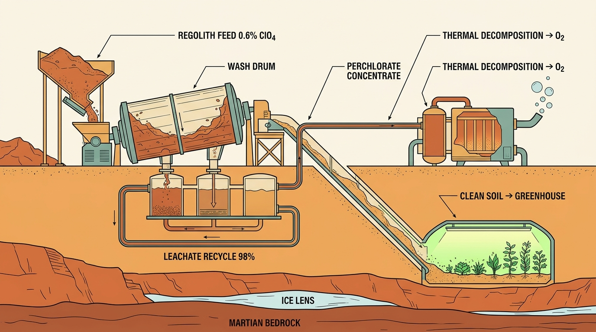
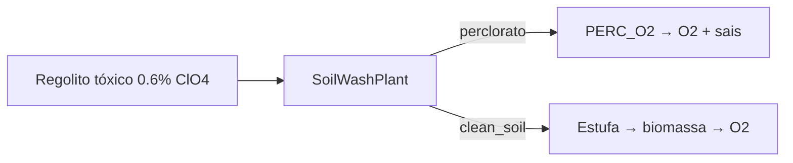

# SoilWashPlant — Usina de Lixiviação (v19)

`src/mars_soil_wash.py`

O diagnóstico que mudou o desenho: o gargalo do perclorato **não era throughput da refinaria — era insumo** (a frota entregava ~4 kg ClO₄/sol). Como ClO₄⁻ é solúvel, a solução física é uma usina fixa que lixivia solo a granel.

## Parâmetros físicos

| Parâmetro | Valor |
|---|---|
| Throughput por era | 0 / 200 / 800 / 6.000 kg-solo/sol |
| Concentração ClO₄⁻ | 0,6% do regolito |
| Eficiência de extração | 90% |
| Água bruta | 0,4 L/kg de solo |
| Reciclo de lixiviado | 98% |
| Energia | 0,08 kWh/kg — pool de 100 kWe |

## Resultados v19

| Métrica | Valor |
|---|---:|
| Solo lixiviado | 52.578 t |
| `clean_soil` produzido | 52.294 t |
| Perclorato alimentado → processado | ~361 t (84% da meta 430 t) |
| O₂ adicional via PERC_O2 | +94,6 t |
| Custo hídrico líquido | −48 L/sol na Era IV |
| Custo de oportunidade | −149 t de massa útil (competição energética honesta) |

## O segundo loop

A estação não só produz O₂ — **limpa o próprio entorno**, convertendo regolito tóxico em substrato agrícola. Ecopoiese materializada como loop de retroalimentação.

## Pendências declaradas

- Adoção de `clean_soil` pela estufa (taxa ainda não modelada — estufa é implícita)
- Meta 430 t marcada como **84% — parcial honesto, não inflado**
