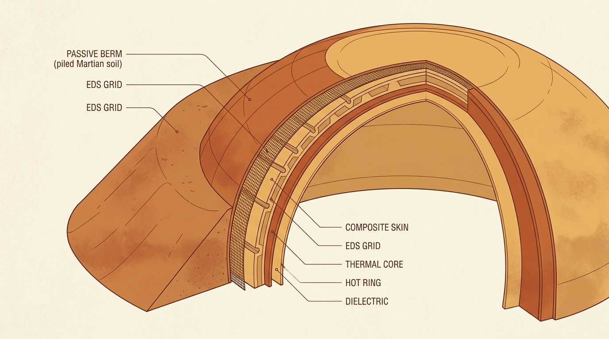
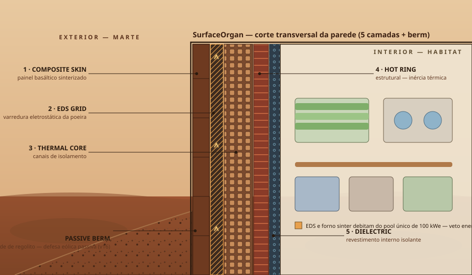

# SurfaceOrgan — a Pele

`src/mars_surface_organ.py`

A pele da estação: cinco camadas físicas — composta externa, varredura eletrostática (EDS), núcleo térmico, anel quente e camada dielétrica — mais o **PassiveBerm** (v16), defesa eólica passiva de regolito.

## Ledger energético

O órgão debita do **pool único de 100 kWe** (`power_base_kw`, por monografia: reator de fissão). `test_surface_organ_consumes_energy` garante `used > 0` e `used ≤ budget` — sem energia, não há sinterização nem EDS.

## Deposição de poeira

`deposition()` combina transporte sazonal (`math.sin` de `season`) com janela de tempestade (`is_storm`), arredondado a 4 casas decimais — quantização determinística que garante paridade bit-a-bit entre plataformas.

## Sem dupla mitigação

`test_no_double_dust_mitigation_by_default` — berm passivo e EDS não podem descontar a mesma poeira duas vezes no mesmo sol por configuração padrão.
