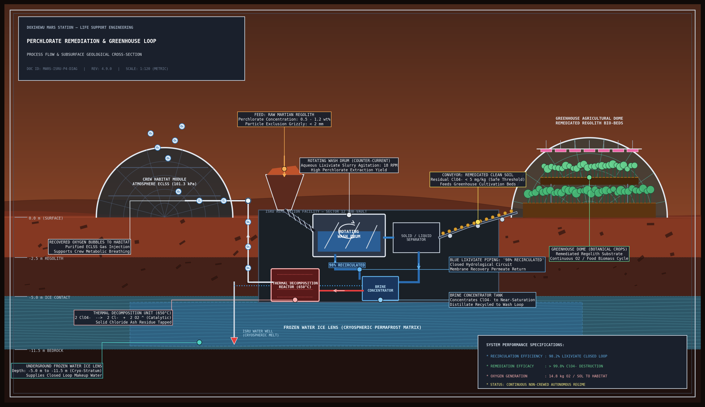
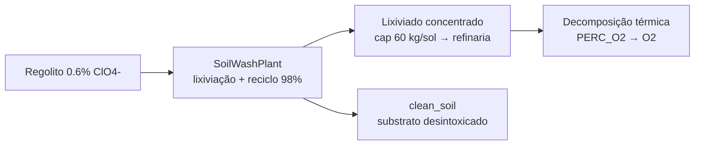

# Cadeia de Perclorato — Desintoxicação

O perclorato (ClO₄⁻, ~0,6% do regolito marciano) é o contaminante que trava agricultura direta e tireoide humana. A cadeia v19 transforma veneno em recurso.

*Fluxo completo da cadeia: feed de regolito → wash drum contracorrente → loop de lixiviado 98% → concentrador → decomposição térmica → O₂ ao habitat; solo limpo → estufa; lente de gelo subterrânea fecha o balanço hídrico.*

## Fluxo

## Números v19

| Métrica | v18 | v19 |
|---|---:|---:|
| Perclorato processado | ~80 t | **~361 t** |
| Gap para meta 430 t | ~5× | **84% atingido** |
| O₂ via PERC_O2 | marginal | +94,6 t |
| clean_soil | — | 52.294 t |

## Conservação

O estoque de perclorato é debitado de verdade (bug do scheduler corrigido na v18: débito em cópia local, nunca no estoque real). Estoque residual: 52,5 kg — a refinaria acompanha a usina; o gargalo voltou a ser insumo, agora limitado pela taxa de lavagem.
