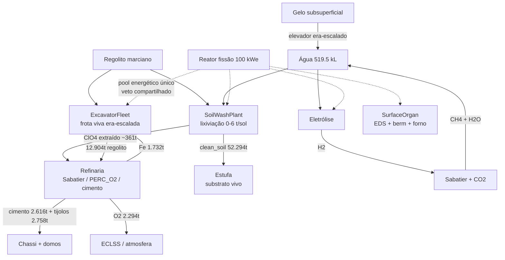

# Doxihewu OmniMind MarsStation

**Máquina-Árvore de Ecopoiese** — uma estação autônoma marciana simulada como organismo, não como máquina. Cada subsistema é um órgão com estado, desgaste, reparo e veto energético; cada cadeia industrial fecha massa e energia de forma auditável.

## Números canônicos (v19, seed 42, 21.060 sols — Sínodo 27)

| Métrica | Valor | Nota |
|---|---:|---|
| Massa útil acumulada | **7.897,3 t** | Fe + cimento + tijolos + H₂SO₄ + Si |
| Regolito minerado | 12.904 t | ExcavatorFleet era-escalada |
| O₂ total | 2.293,9 t | 56% fotossíntese / 36% eletrólise / 8% perclorato |
| Água final | 519.543 L | mínimo 2.003 L (Era II) |
| Perclorato processado | ~361 t | 84% da meta aspiracional (430 t) |
| Solo lixiviado / clean_soil | 52.578 t / 52.294 t | substrato desintoxicado p/ estufa |
| Frota | 109 fabricadas / 64 canibalizadas / 638 recondicionamentos / 39 perdas | auto-fabricada do próprio Fe |
| Incidentes / Integridade | 217 / 0,5691 | blindagem UV/rad ativa |

## A árvore de cadeias

## Organização da documentação

- **[Arquitetura](architecture/station-body.md)** — os órgãos: corpo de 11 camadas, pele EDS, frota, usina de lixiviação
- **[Cadeias](chains/water.md)** — os loops de massa: água, oxigênio, aço, perclorato
- **[Governança](governance/s-meta.md)** — S-Meta, lei da conservação pareada, portão de habitabilidade
- **[Experimentos](experiments/e10-monte-carlo.md)** — Monte Carlo, calibração bayesiana, auditoria de versões
- **[Resultados](results/longrun-21060.md)** — números canônicos verificados bit-a-bit (local ≡ Colab)

## Código

| Módulo | Papel |
|---|---|
| `src/mars_unified_simulator.py` | Loop mestre de 21.060 sols |
| `src/mars_excavator_fleet.py` | Frota viva — colheita, desgaste, reciclagem |
| `src/mars_soil_wash.py` | Usina de lixiviação de perclorato |
| `src/mars_refinery.py` | Scheduler estequiométrico (Sabatier, PERC_O2, cimento) |
| `src/mars_station_body.py` | Corpo — 11 camadas + integridade |
| `src/mars_surface_organ.py` | Pele — EDS, berm passivo, forno sinter |
| `src/mars_shielding_materials.py` | Blindagem UV/rad + airlock/EVA |

!!! note "Paridade verificada"
    Os resultados v19 são reproduzidos bit-a-bit entre ambiente local (Python 3.12) e Colab (Python 3.13) — mesma seed, mesmos números. Artefato canônico: `job_results/station_longrun_21060_v19_soilwash.json` no dataset HF `fabricioslv/mars-monoculture-data`.
